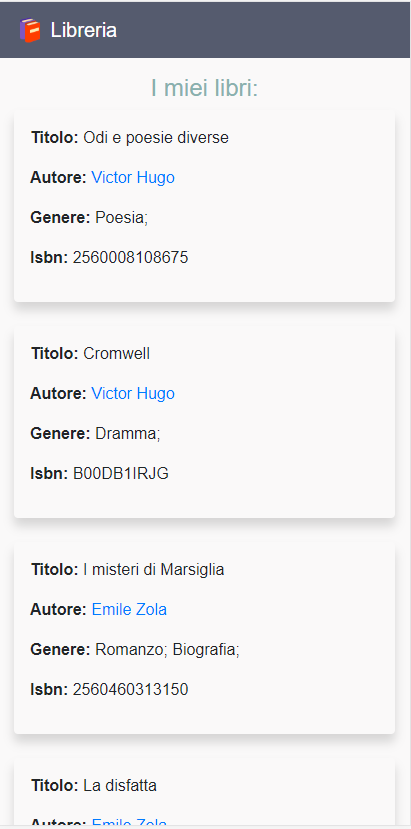

# Libreria

Libreria è una piccolissima applicazione, sviluppata con l'intento di imparare ad utilizzare nuove tecnologie, rispetto a quella utilizzate in ambito professionale.  
È stata scritta in python3 e django2. Per la gestione del database viene utilizzata la database API di django in coppia con SQLite.
> ***Nota*** : La versione di python utilizzata è la 3.7.1, ma dovrebbe essere compatibile con qualsiasi versione di python3

## Installazione

Per fare il setup del progetto bisogna assicurarsi che sia installata [python3](https://www.python.org/downloads/).  
Consiglio di farsi un virtual environment apposito per il progetto:
```bash
python3 -m venv v_env
```

Attivare poi il virtual environment con uno dei seguenti comandi a seconda del SO:
Linux/OS X
```bash
source v_env/bin/activate
```
Windows:
```bash
v_env/Scripts/activate
```

Successivamente installare [django 2](https://docs.djangoproject.com/en/2.1/topics/install/) utilizzando [pip](https://pip.pypa.io/en/stable/installing/) con il seguente comando bash:
```bash
pip install django
```

Eseguire questa serie di comandi poi per eseguire le migrazioni del db, creare un superuser per console di amministrazione e far partire il server (assicurarsi di essere sempre all'interno dell'ambiente virtuale):  
```bash
python manage.py migrate
python manage.py createsuperuser
python manage.py makemigrations libreria
python manage.py migrate
python manage.py runserver
```


## Descrizione tecnica

Come già scritto in precedenza il progetto è stato sviluppato utilizzando il framework django. È possibile fare le classiche operazioni CRUD attraverso la console admin di django (abilitata solamente per una utenza). La console è stata configurata per lavorare su tutti i modelli presenti nell'applicazione (Autore, Genere e Libro).  

Per quanto riguarda lo style delle pagine è stato utilizzato [bootstrap 4](https://getbootstrap.com/docs/4.1/getting-started/introduction/), l'applicazione è responsive e risulta essere adatta ad essere vista sia da versione desktop che mobile.

## Descrizione funzionale

L'applicazione risulta essere estremamente semplice anche in ambito funzionale.  
La homepage si presenta con una lista dei libri inseriti con varie info tra cui l'autore. L'autore risulta essere un link cliccabile che rimanda al dettaglio dell'autore.  
La pagina autore_detail presenta le varie info dell'autore ed i libri da lui scritti e presenti sul database.


## Screenshot home


